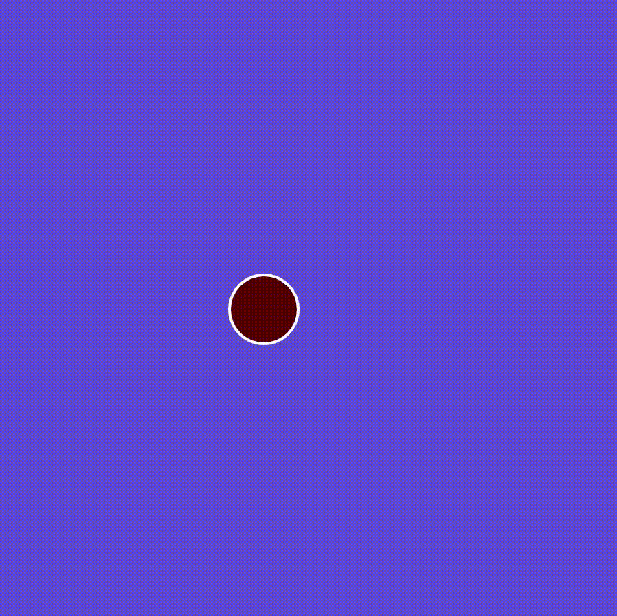

# Conditionals / Bouncing Ball P5.JS

- Using if / else if to determine if ellipse has reached left or right side of canvas

- If the ellipse is with in diameter/2 (distance to outer edge of ellipse as it encounters edge of canvas)  of edge, the ellipse is sent opposite direction.

- on each change of direction, the ellipse changes fill(color) and each full circut (back and forth) background changes color

